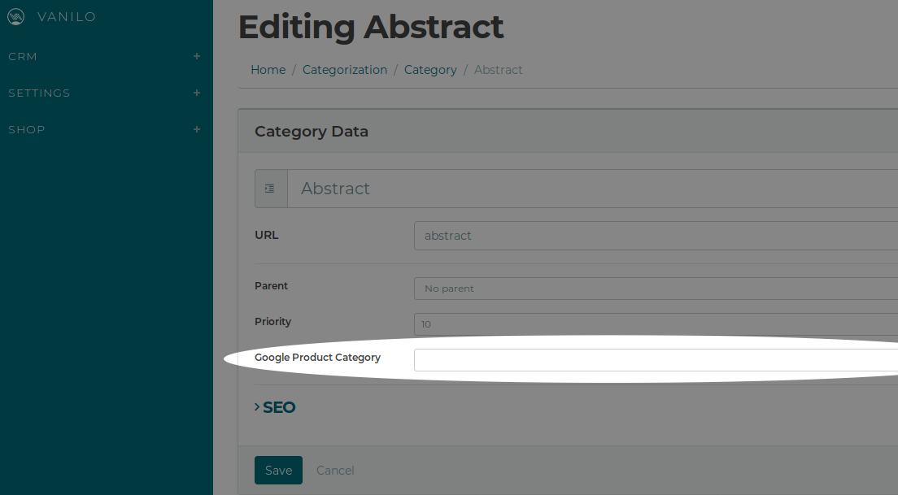

A very typical scenario is to [add/remove fields](use-custom-models-in-your-application.md) to/from
base Vanilo models. Changing the model layer however, won't automatically make those fields
available in the Admin area.

## Add Field to Existing View

To customize the admin views, you can simply use Laravel's
[override package views feature](https://laravel.com/docs/5.8/packages#views).

As an example, let's add the `google_product_category` field to the the category editing area.

> The `google_product_category` field is not present in the base Vanilo model, this example assumes
> that you've already added it to the `taxons` table by creating a migration.

**Steps:**

- Create a directory in your app's root folder: `resources/views/vendor/vanilo/taxon`
- Copy `vendor/vanilo/framework/src/resources/views/taxon/_form.blade.php` to the folder created above
- Add the field to the copied file: 
- It will show up on both the create and edit taxon forms: 

The saving/fetching of the field will happen automatically, without the need for modifying the
controller.

## Optional - Extend Validation

If you want the apply validation to the new field then you'll have to do some additional steps.

The base admin contains
[customizable request form types](https://konekt.dev/concord/1.3/request-types#customizing-requests)
where you can add the new field.

The update taxon and create taxon requests are separate classes so that you can apply separate logic
to them. If you want to apply the same logic to both, then you need to extend both classes.

**Steps:**

- Create the extended request classes in your application:
```php
// app/Http/Requests/CreateTaxon.php
namespace App\Http\Requests;

use Vanilo\Framework\Http\Requests\CreateTaxon as BaseCreateTaxon; 

class CreateTaxon extends BaseCreateTaxon
{
    public function rules()
    {
        $rules = parent::rules();
        $rules['google_product_category'] = 'required|min:16|max:255';

        return $rules;
    }
}
```

```php
// app/Http/Requests/UpdateTaxon.php
namespace App\Http\Requests;

use Vanilo\Framework\Http\Requests\UpdateTaxon as BaseUpdateTaxon; 

class UpdateTaxon extends BaseUpdateTaxon
{
    public function rules()
    {
        $rules = parent::rules();
        $rules['google_product_category'] = 'required|min:16|max:255';

        return $rules;
    }
}
```
- Register the modified requests so that the underlying modules use it:
```php
// app/Providers/AppServiceProvider.php
class AppServiceProvider extends ServiceProvider
{
    public function boot()
    {
        $this->app->concord->registerRequest(
            \Vanilo\Framework\Contracts\Requests\CreateTaxon::class,
            \App\Http\Requests\CreateTaxon::class
        );
        
        $this->app->concord->registerRequest(
            \Vanilo\Framework\Contracts\Requests\UpdateTaxon::class,
            \App\Http\Requests\UpdateTaxon::class
        );
    }
}
```

This way the field will be validated according to your rules without the need for modifying the
controller.


